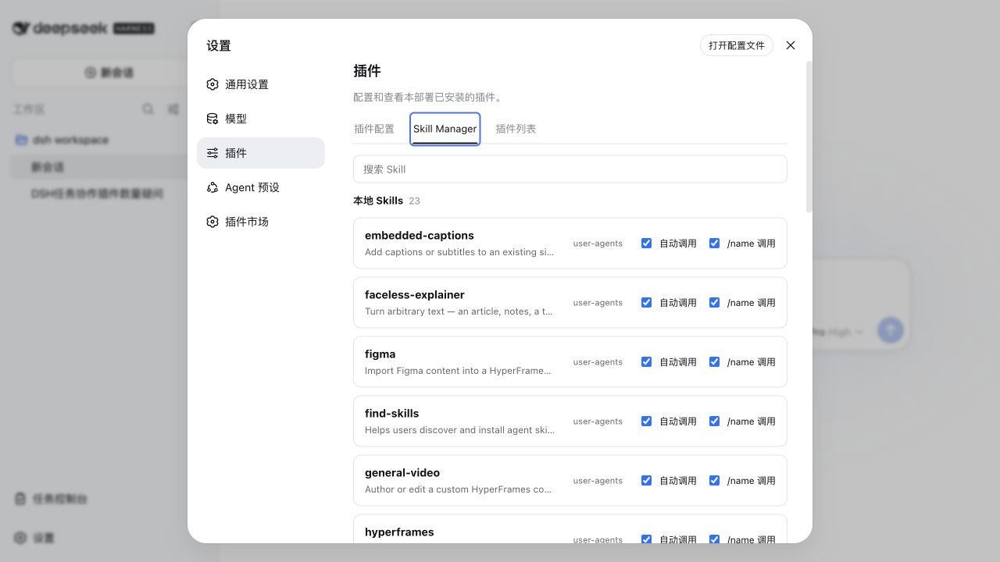

# DSH Skill Manager

[English](README.md)

一个面向 [DeepSeek Harness](https://github.com/deepseek-ai/deepseek-harness) Web 的轻量、本地、安全优先的 Skill 管理插件。



## 能做什么

- 列出当前 DSH 会话和项目实际生效的本地 Skills。
- 按名称、描述、来源、Provider 和路径搜索。
- 展开列表行时才加载指令正文。
- 查看来源、Provider 和解析后的文件路径。
- 在每个列表行内直接控制**自动调用**和 **/name 调用**。
- 内置、软链接、运行时和非文件型 Skill 保持只读。

插件有意不包含安装、删除、新建、同步或 Skill 市场功能；它只管理 DSH 已发现 Skill 的调用策略。

## 安装

需要 Node.js `^22.19.0 || >=24.0.0`，以及兼容 `0.1.0-rc.7` 或 `0.1.1-rc.2` SDK 系列的 DSH Web profile。

直接从 GitHub 安装：

```bash
dsh plugin --profile web add github:SLin-code/dsh-skill-manager
```

仓库包含已验证的 Host 与浏览器 bundle，因此安装时不需要执行依赖构建脚本。

重启 `dsh web`，打开**设置 → 插件 → Skill Manager**，并选中一个会话。卸载命令：

```bash
dsh plugin --profile web remove dsh-skill-manager
```

本地开发安装：

```bash
npm install
npm run typecheck
npm test
npm run build
dsh plugin --profile web add .
```

## 安全模型

浏览器只提交当前 `sessionId`、准确的 Skill 名称和两个调用布尔值，不提交文件路径。每次操作时，Host 都通过官方 `ctx.sessions` 和 `ctx.skills` 服务重新解析会话项目目录与最终生效的 Skill。

修改路由只接受本机回环、同源请求。写入前，Host 会重新校验 YAML frontmatter 和 Skill 身份，拒绝内置与软链接条目，获取跨进程锁，并在同目录执行原子替换；正文及 YAML 注释会尽量保持不变。

两个标准 frontmatter 字段是：

```yaml
disable-model-invocation: false
user-invocable: true
```

## 架构

这是一个独立的双端 DSH 插件仓库：

- `cordis.patch.yml` 向选定 profile 插入一个插件条目。
- `src/index.ts` 是 Host 端，注册本机 API 路由。
- `src/client/index.tsx` 是浏览器端，通过官方 Settings slot 注册界面。
- `package.json` 中的 `dsh.bundle.patch` 与 `dsh.client` 连接两端，无需修改 DSH 源码。

## 开发验证

```bash
npm run typecheck
npm test
npm run build
npm pack --dry-run
```

## 许可证

[MIT](LICENSE)
